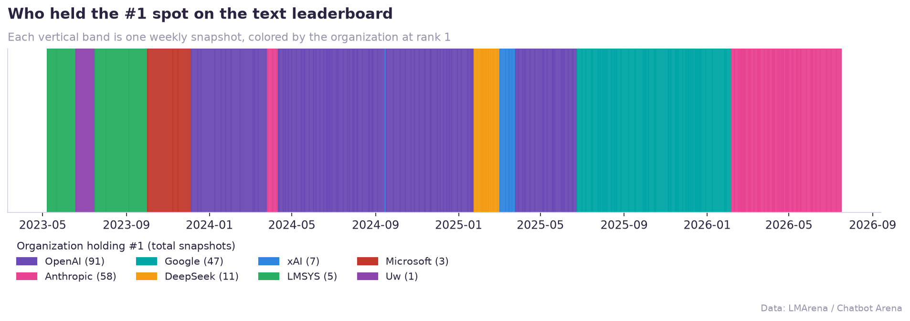
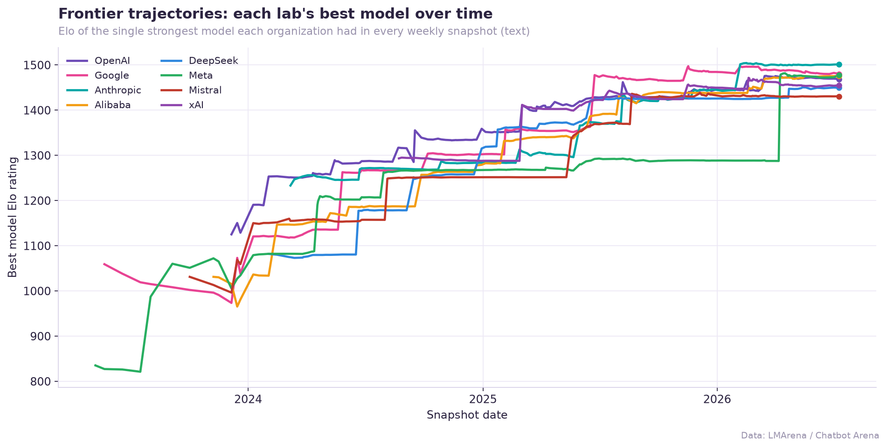
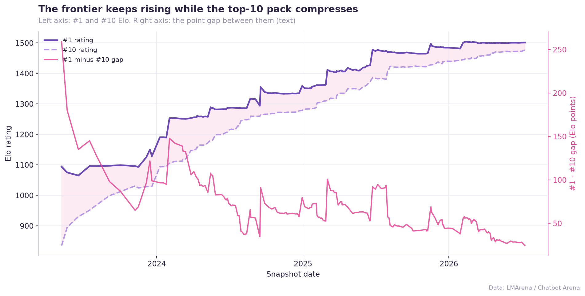
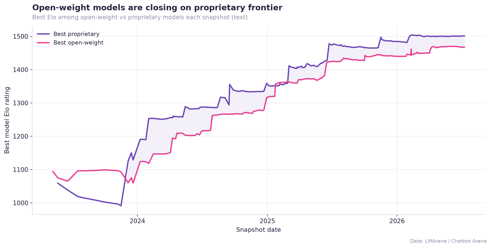

# The AI Model Race, 2023–2026 — An LMArena Leaderboard Analysis

Three years of the AI frontier, told through **247 weekly [LMArena / Chatbot Arena](https://lmarena.ai) leaderboard snapshots** (~97,000 rows, May 2023 → July 2026). The Arena ranks AI chat models by an **Elo score** derived from millions of head-to-head human preference votes — so this dataset is, in effect, a week-by-week scoreboard of who was winning the AI race.

This project cleans that history, reconstructs each weekly leaderboard, and answers eleven questions about how the race actually unfolded.

> **Reading Elo:** higher is better. A ~35-point gap ≈ the stronger model wins the head-to-head about 55% of the time. Each rating has a 95% confidence interval — if two models' intervals overlap, they're a statistical tie.

---

## TL;DR — what the data says

- **It's a three-horse race.** OpenAI led the most weeks (91 of 247), but **Anthropic holds the longest unbroken reign — 53 straight weeks**. Google's 47 weeks at #1 all came in a single Jun 2025 → Jan 2026 run. Together, three labs owned ~95% of all #1 finishes.
- **The frontier rises while the pack compresses.** The #1 rating climbed **+407 Elo** (1094 → 1501), yet the gap between #1 and #10 **collapsed from 259 points to ~24** — "top-10" is now nearly a commodity.
- **Open weights nearly caught up.** Best open-weight model now trails the best proprietary one by only **~34 Elo**, down from 100+ in 2024.
- **China pulled roughly level.** The West-vs-China frontier gap shrank to **~26 Elo**; Chinese labs held #1 for 12 weeks (DeepSeek's early-2025 run).
- **Most rankings are statistical ties.** In the latest snapshot, **371 of 373 adjacent-rank pairs have overlapping confidence intervals** — including #1 vs #2. Vote count drives precision (correlation between votes and interval width: **−0.89**).

Full writeup with every number: **[analysis/FINDINGS.md](analysis/FINDINGS.md)**.

---

## The race for #1



Leadership used to flip week to week; it now moves in multi-month blocks. The early era belonged to open research models (LMSYS/Vicuna); OpenAI dominated 2024, Google broke through in mid-2025, and Anthropic leads today.

## Every lab is climbing the same staircase



Each lab's strongest model climbs in synchronized steps (every step = a new flagship release), and the leaders have bunched into a tight **1450–1500** band. No lab holds a durable moat — a rival's next release routinely erases the lead within weeks.

## The frontier rises as the top-10 compresses



The ceiling keeps climbing while the chasing pack closes in — the #1-to-#10 spread is now narrower than many models' own confidence intervals.

## Open weights vs. proprietary



The gap between the best open-weight model and the best closed model has narrowed to ~34 Elo. Open weights even led outright in 19 of 223 snapshots.

*(Six more charts — China vs. US, longest model reigns, fastest climbers, top-10 license mix, votes-vs-precision, subset specialists, and the style-control effect — are in [`charts/`](charts/) and discussed in [FINDINGS.md](analysis/FINDINGS.md).)*

---

## Reproduce it

```bash
pip install -r requirements.txt
python analysis/arena_analysis.py
```

The script loads the raw CSV, cleans it, computes all eleven analyses, regenerates every chart in `charts/`, and writes `analysis/FINDINGS.md`. It's the single source of truth — no manual steps.

## Repo structure

```
ai-model-arena-analysis/
├── README.md                    # you are here
├── requirements.txt
├── data/
│   └── ai_model_arena_rankings.csv   # raw leaderboard history
├── analysis/
│   ├── arena_analysis.py             # reproducible pipeline (cleaning + analysis + charts)
│   └── FINDINGS.md                   # full writeup, one section per question
└── charts/                           # 11 publication-quality PNGs
```

## Method notes

- **Cleaning:** organization names normalized for casing/whitespace; ~3,477 blank orgs labeled `Unknown`; licenses classified as **open-weight** (Apache, MIT, Llama/Gemma/Qwen/DeepSeek families, etc.) vs **proprietary**.
- **Data-quality fix:** 686 duplicate rows — where several leaderboard refreshes were stacked under one publish date (mostly 2026-06-10, which had six "rank-1" rows) — were resolved by keeping one row per model per snapshot and re-ranking each board. This removed phantom reign-flips and spurious Elo jumps.
- **Note on the data:** this leaderboard history extends into 2026 with forward-dated model names. The analysis describes the dataset exactly as given.

*Data source: LMArena / Chatbot Arena.*
